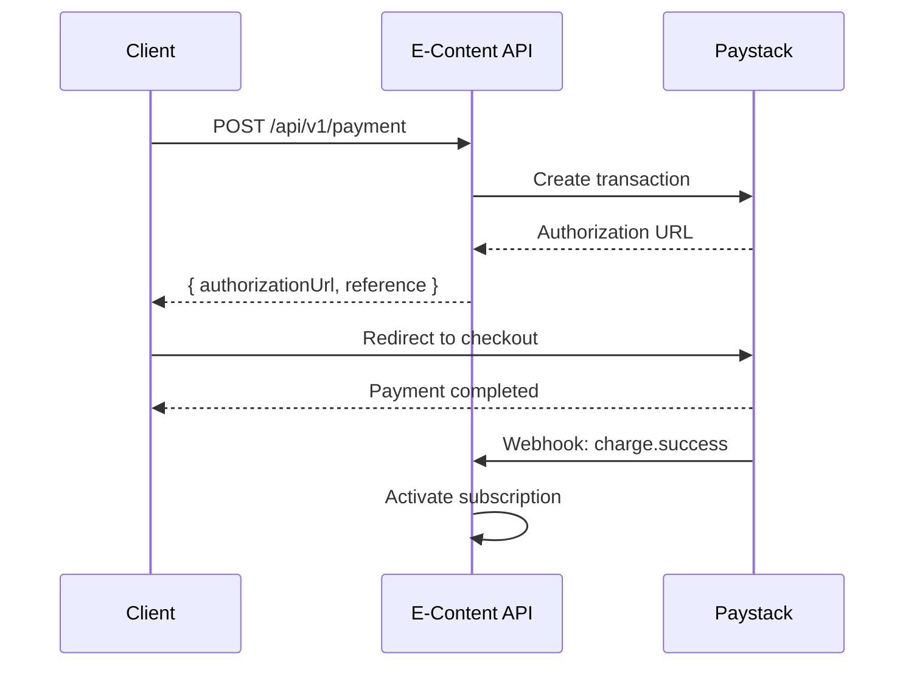

import ApiCodeToggler from '@site/src/components/ApiCodeToggler';
import ApiResponse from '@site/src/components/ApiResponse';

# Payments

Process payments for subscription plans using the integrated Paystack payment gateway.

**Base URL:** `https://api.e-Content.com/api/v1/payment`

---

## Payment Flow

The payment process follows a redirect-based flow:

```
1. Client initiates payment via API
2. API creates a Paystack transaction
3. API returns an authorization URL
4. User completes payment on Paystack checkout page
5. Paystack sends a webhook notification on success
6. API activates the user's subscription
```



---

## Initiate Payment

<span class="badge--post">POST</span> `/api/v1/payment`

Creates a new payment transaction and returns a Paystack authorization URL for the user to complete payment.

### Request

**Headers:**

| Header | Value | Required |
|---|---|---|
| `Content-Type` | `application/json` | ✅ |
| `Authorization` | `Bearer <token>` | ✅ |

**Body Parameters:**

| Parameter | Type | Required | Description |
|---|---|---|---|
| `planId` | `string` (UUID) | ✅ | The ID of the plan to purchase |
| `amount` | `number` | ✅ | Payment amount |
| `currency` | `string` | ✅ | Three-letter currency code (e.g., `GHS`, `NGN`, `USD`) |
| `email` | `string` | ✅ | Customer email for Paystack receipt |

**Example:**

<ApiCodeToggler
  method="POST"
  endpoint="/payment"
  body={{
    planId: "p2b3c4d5-e6f7-8901-bcde-f12345678901",
    amount: 29.99,
    currency: "GHS",
    email: "user@example.com"
  }}
  label="INITIATE PAYMENT"
/>

### Response

**201 Created** — Payment transaction initiated:

<ApiResponse
  title="201 Created"
  data={{
    reference: "pay_ref_abc123def456",
    authorizationUrl: "https://checkout.paystack.com/abc123def456",
    status: "pending"
  }}
/>

### Response Fields

| Field | Type | Description |
|---|---|---|
| `reference` | `string` | Unique payment reference for tracking |
| `authorizationUrl` | `string` | URL to redirect the user to for payment completion |
| `status` | `string` | Current payment status (`pending`) |

---

## Supported Currencies

| Currency | Code | Countries |
|---|---|---|
| Ghana Cedi | `GHS` | Ghana |
| Nigerian Naira | `NGN` | Nigeria |
| Kenyan Shilling | `KES` | Kenya |
| South African Rand | `ZAR` | South Africa |
| US Dollar | `USD` | International |

---

## Integration Example

Here's a complete example of integrating the payment flow in a web application:

```javascript title="payment-integration.js"
async function subscribeToPlan(planId, amount, currency) {
  // Step 1: Initiate payment
  const response = await fetch('https://api.e-Content.com/api/v1/payment', {
    method: 'POST',
    headers: {
      'Content-Type': 'application/json',
      'Authorization': `Bearer ${userToken}`,
    },
    body: JSON.stringify({
      planId,
      amount,
      currency,
      email: currentUser.email,
    }),
  });

  const { authorizationUrl, reference } = await response.json();

  // Step 2: Store reference for tracking
  localStorage.setItem('payment_reference', reference);

  // Step 3: Redirect to Paystack checkout
  window.location.href = authorizationUrl;
}

// Usage
subscribeToPlan('plan-uuid', 29.99, 'GHS');
```

:::tip Callback URL
Configure your Paystack dashboard callback URL to redirect users back to your application after payment. The API will handle subscription activation automatically via webhooks.
:::

---

## Related

- **[Plans →](./plans)** — Browse available subscription plans
- **[Webhooks →](./webhooks)** — Handle payment confirmation events
